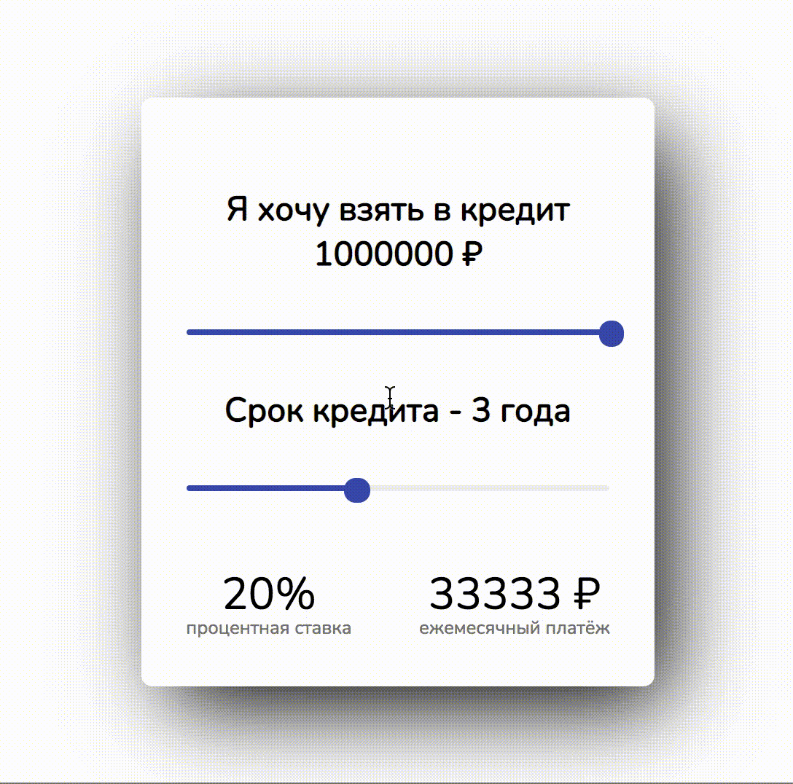

## Кредитный калькулятор на React + React hooks

> Простой калькулятор для подсчета кредита на React

Обсудить здесь: https://unicoding.dev/react

Передвигайте ползунки для подсчета оптимальной кредитной нагрузки

## Preview



## Demo

https://grhgrmgrhrm.github.io/credit-calculator/

## Installation

### Setup

```sh
git clone https://github.com/grhgrmgrhrm/credit-calculator.git
cd credit-calculator
npm install
npm start
```

### Tests

```sh
npm run test
```
